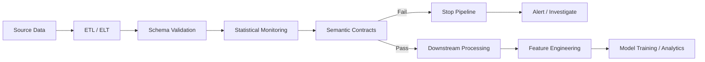

<div align="center">

# Semantic Contracts for Data Pipeline Reliability

### Detecting silent ETL failures that schema checks and drift monitoring can miss

[](https://www.python.org/)
[](https://github.com/idrees118/Research_Paper_Semantic-Contracts-mlops)
[](https://github.com/idrees118/Research_Paper_Semantic-Contracts-mlops)
[](https://github.com/idrees118/Research_Paper_Semantic-Contracts-mlops)
[](https://docs.pytest.org/)
[](#research)

**Python · ETL Validation · Data Quality · Mutation Testing · MLOps · Reproducible Research**

</div>

---

## The problem

A data pipeline can run successfully and still produce the wrong data.

The schema may be valid.  
The columns may still be numeric.  
Missing-value checks may pass.  
Distribution monitoring may show little change.

But the **meaning of the data can still be broken**.

Examples:

```text
Open / Close columns swapped
        ↓
Schema still valid

Timestamp shifted by 7 days
        ↓
Feature distributions unchanged

Five stores missing from an ETL batch
        ↓
Remaining rows still look normal

Weekly sales aggregated twice
        ↓
Pipeline finishes successfully
```

This project explores how to detect these kinds of **silent relational failures before corrupted data reaches downstream analytics or machine-learning workflows**.

---

## What I built

I implemented a validation framework based on **semantic contracts**.

A semantic contract is a deterministic rule that checks whether an important relationship in an incoming dataset still holds relative to an accepted reference dataset.

Instead of checking only individual columns, the framework can validate relationships such as:

- column identity and cross-column consistency
- timestamp alignment and ordering
- expected entities and groups
- row-count relationships
- unit and scaling consistency
- categorical-frequency behaviour
- time-series structure
- duplication and missing-segment behaviour

The framework contains **25 domain-aware contracts** and evaluates them using controlled mutation testing.

---

## Pipeline concept



The idea is not to replace schema or drift checks.

It is to add another validation layer for relationships that those checks may not explicitly represent.

---

## Mutation-testing approach

To evaluate the validation layer, I created controlled ETL-style faults with known ground truth.

The benchmark contains:

| | |
|---|---:|
| Semantic contracts | **25** |
| Controlled fault types | **28** |
| Random seeds | **4** |
| Seed-level executions | **112** |
| Primary datasets | **3** |
| Validation approaches compared | **4** |

The faults cover four main families plus one aggregation case study:

| Fault family | Examples |
|---|---|
| **Scaling** | unit conversion errors, incorrect calibration, systematic scaling |
| **Temporal** | timestamp shifts, lagged dates, reversed series, shuffled records |
| **Structural** | column swaps, missing entities, missing segments, repeated data |
| **Quality** | spikes, extreme outliers, frozen values, duplicate rows, sparse zeroing |
| **Aggregation** | repeated aggregation producing inflated values |

---

## Example failure

Consider a stock-data pipeline:

```text
Before ETL error

Open      Close
150.20    151.10
151.00    150.80


After accidental column swap

Open      Close
151.10    150.20
150.80    151.00
```

The schema is unchanged.

Both columns are still numeric.

Their distributions may also be very similar.

But their **relationship and meaning are wrong**.

A semantic contract can explicitly test that relationship rather than relying only on marginal statistics.

---

## Evaluation

The framework was evaluated across three different data domains:

| Dataset | Scale | What it tests |
|---|---:|---|
| **Walmart Retail Sales** | 6,435 store-week observations | entities, dates, sales, duplication, aggregation |
| **AAPL OHLCV** | 1,259 trading days | temporal and cross-column relationships |
| **Household Power Consumption** | 996,010 measurements | high-frequency sensor and temporal behaviour |

A separate **UCI Adult** experiment was also used as a proof-of-concept transfer to categorical data.

---

## Results

Primary results are calculated at the **28 mutation-type level**.  
The four seeds are stability repetitions rather than independent observations.

| Validator | Faults detected | Detection rate |
|---|---:|---:|
| **Semantic Contracts** | **27 / 28** | **96.4%** |
| Ensemble Statistical | 14 / 28 | 50.0% |
| KS Drift | 12 / 28 | 42.9% |
| GE-style Expectations | 10 / 28 | 35.7% |

**Semantic-contract 95% Wilson CI:** 82.3%–99.4%

The semantic validator also achieved **96.3% semantic precision**, meaning that 26 of the 27 detected fault types were attributed to the intended detector family.

The study additionally evaluates fault mechanisms derived from public issue reports involving tools such as **scikit-learn, dbt, pandas, Apache Spark, Airbyte and Polars**.

> These results describe performance on the evaluated benchmark. They are not a claim that semantic contracts detect every possible production failure.

---

## Why this is relevant to Data Engineering

For me, the main engineering question behind this project was:

> **How do we stop technically valid but semantically corrupted data from moving further through a pipeline?**

That connects directly to several Data Engineering concerns:

**Data quality**

Validate not only whether values are present, but whether relationships between them remain correct.

**Pipeline testing**

Inject controlled failures and measure whether the validation layer actually catches them.

**ETL reliability**

Detect issues such as duplication, missing entities, incorrect transformations and timestamp errors before downstream use.

**Data contracts**

Express expectations about what data should mean, not only how it should be typed.

**MLOps**

Use validation as a gate between an incoming ETL batch and downstream feature engineering or model training.

**Reproducibility**

Keep mutations, thresholds, experiment configuration, statistical analysis and outputs version-controlled.

---

## Project architecture

```text
Research_Paper_Semantic-Contracts-mlops/
│
├── main.py
│
├── configs/
│   └── experiment.yaml
│
├── src/
│   ├── mutations/
│   │   ├── operators.py
│   │   └── registry.py
│   │
│   ├── validators/
│   │   ├── contracts.py
│   │   └── semantic_validator.py
│   │
│   ├── baselines/
│   │   ├── ensemble_baseline.py
│   │   ├── ks_drift_baseline.py
│   │   └── ge_baseline.py
│   │
│   └── evaluation/
│       ├── runner.py
│       └── metrics.py
│
├── scripts/
│   ├── prepare_datasets.py
│   ├── run_experiment.py
│   ├── held_out_evaluation.py
│   ├── ablation_analysis.py
│   ├── adult_validation.py
│   └── wine_fpr.py
│
├── tests/
│   └── test_pipeline.py
│
├── data/
├── experiments/results/
├── requirements.txt
├── setup.py
└── pytest.ini
```

The code is separated into **fault generation, validation, baseline methods and evaluation**, rather than placing the full experiment inside one notebook.

---

## Testing

The repository includes **37 tests** covering:

- semantic contracts
- mutation operators
- statistical metrics
- baseline validators
- clean-data behaviour
- mutation registry integrity
- semantic-validator integration
- mini end-to-end experiment execution

Run them with:

```bash
python main.py --test
```

or:

```bash
pytest tests/ -v
```

---

## Run the project

Clone the repository:

```bash
git clone https://github.com/idrees118/Research_Paper_Semantic-Contracts-mlops.git
cd Research_Paper_Semantic-Contracts-mlops
```

Create an environment:

```bash
python -m venv .venv
source .venv/bin/activate
```

Install dependencies:

```bash
pip install -r requirements.txt
```

Prepare the datasets:

```bash
python main.py --prepare
```

Run the controlled experiment:

```bash
python main.py --experiment
```

Run the retrospective held-out analysis:

```bash
python main.py --held-out
```

Or run the main workflow:

```bash
python main.py --all
```

---

## Reproduce additional analyses

```bash
# Detector-family ablation
python scripts/ablation_analysis.py

# UCI Adult transfer experiment
python scripts/adult_validation.py

# Additional clean-control analysis
python scripts/wine_fpr.py
```

Experiment settings such as seeds and validation thresholds are centralised in:

```text
configs/experiment.yaml
```

---

## Tech stack

| Area | Technologies |
|---|---|
| Language | Python |
| Data processing | pandas, NumPy |
| Statistical analysis | SciPy |
| Configuration | YAML |
| Testing | pytest |
| Engineering concepts | ETL validation, data contracts, mutation testing |
| ML infrastructure | MLOps, pre-training data validation |
| Reproducibility | versioned configs, experiment outputs, deterministic mutations |

---

## Data sources

**Walmart Retail Sales**  
https://www.kaggle.com/c/walmart-recruiting-store-sales-forecasting

**Apple AAPL Historical Data — Yahoo Finance**  
https://finance.yahoo.com/quote/AAPL/history/

**UCI Household Electric Power Consumption**  
https://doi.org/10.24432/C58K54

**UCI Wine Quality**  
https://doi.org/10.24432/C56S3T

**UCI Adult**  
https://doi.org/10.24432/C5XW20

---

## Research

This repository supports the manuscript:

**Semantic Contracts for Detecting Relational Faults in Machine Learning Pipelines: A Mutation-Based Empirical Evaluation**

**Current status:** manuscript under review.

Authors:

**Muhammad Idrees · Feras Al-Obeidat · Adnan Amin · Salma Noor · Fernando Moreira**

The study positions semantic contracts as a **complementary validation layer**, not as a replacement for tools such as Great Expectations, Deequ, dbt, Soda, or statistical monitoring systems. :chatgpt-content-reference{index="0"}

---

## Key takeaway

A reliable data pipeline should not only ask:

> **“Does this batch have the correct schema?”**

It should also be able to ask:

> **“Do the relationships inside this data still make sense?”**

That is the problem this project explores.

---

<div align="center">

### Data Engineering · Data Quality · ETL Reliability · MLOps · Mutation Testing

[View Repository](https://github.com/idrees118/Research_Paper_Semantic-Contracts-mlops) ·
[Open an Issue](https://github.com/idrees118/Research_Paper_Semantic-Contracts-mlops/issues)

</div>
