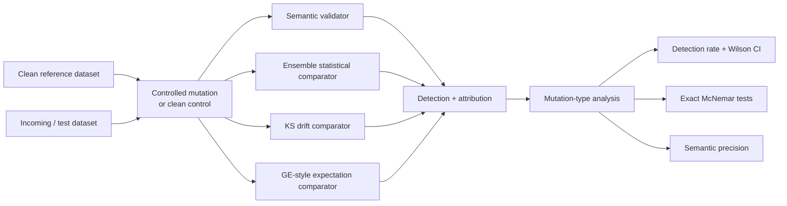
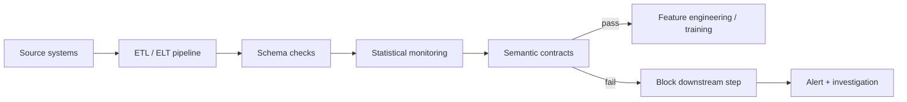

from pathlib import Path

readme = r'''<div align="center">

# Semantic Contracts for Relational Data Validation in ML Pipelines

### Mutation-based evaluation of deterministic data-quality checks at the ETL → model-training boundary

[](https://www.python.org/)
[](https://pandas.pydata.org/)
[](https://scipy.org/)
[](https://docs.pytest.org/)
[](#why-this-matters)
[](#research-status)

**Reference implementation and reproducibility repository for**

*Semantic Contracts for Detecting Relational Faults in Machine Learning Pipelines:  
A Mutation-Based Empirical Evaluation*

</div>

---

## Overview

Production data pipelines can fail without breaking the schema.

A column can keep the correct numeric type while containing the wrong field. Timestamps can shift while feature distributions remain unchanged. A pipeline can duplicate records, drop entities, apply the wrong unit conversion, or preserve individually plausible columns while corrupting the relationships between them.

This project studies that class of failure.

It implements **semantic contracts**: deterministic, domain-aware checks that test whether important relationships in an incoming dataset still hold relative to an accepted reference dataset. The contracts complement ordinary schema validation and statistical drift monitoring by checking properties such as:

- cross-column relationships,
- temporal alignment and ordering,
- entity completeness,
- row-count consistency,
- scaling and ratio relationships,
- categorical-frequency consistency,
- local signal-quality patterns.

The repository evaluates those checks through **mutation testing**: known ETL-style faults are injected into clean datasets and four validation strategies are compared under a controlled, reproducible protocol.

> **Scope:** this work does not claim to invent cross-column validation. Existing systems such as Great Expectations, Deequ, dbt, and Soda can express custom relational checks. The contribution is the fault formalisation, reusable invariant families, mutation taxonomy, and empirical evaluation protocol.

---

## Why this matters

Traditional validation layers answer different questions:

| Validation layer | Main question | Typical examples |
|---|---|---|
| **Schema validation** | Is the dataset structurally valid? | columns, dtypes, nulls, allowed ranges |
| **Statistical monitoring** | Has the observed distribution changed? | KS, Jensen–Shannon divergence, PSI, correlation/ACF monitoring |
| **Semantic contracts** | Does the data still mean what the pipeline says it means? | column identity, time alignment, entity completeness, cross-field relationships |

A robust production pipeline may need more than one layer. A batch can satisfy its schema and retain plausible marginal statistics while still violating a domain relationship that matters downstream.

This repository focuses on that relational layer.

---

## Evaluation workflow



The primary benchmark contains **28 fault types** evaluated under **4 random seeds**, producing **112 seed-level executions**. The repeated seeds are used as a stability check; the primary inferential unit is the **mutation type (N = 28)**.

---

## Fault taxonomy

The controlled benchmark contains **27 categorised semantic mutations plus one aggregation case study**.

| Fault family | Count | Representative failure modes |
|---|---:|---|
| **Scaling** | 6 | unit conversion errors, systematic under/over-scaling, calibration mistakes |
| **Temporal** | 6 | timestamp shifts, one-day lags, reversed series, within-day shuffling |
| **Structural** | 9 | column swaps, missing entities, row loss, repeated data, sign errors |
| **Quality** | 6 | spikes, extreme outliers, frozen segments, sparse zeroing, duplicate rows, noise |
| **Aggregation case study** | 1 | repeated aggregation causing 7× sales inflation |
| **Total** | **28** | |

Examples include swapping stock `Open` and `Close`, shifting retail dates by ±7 days, dropping stores from a batch, repeating the power dataset, zeroing trading volume, injecting sensor spikes, and duplicating ETL output rows.

---

## Semantic contract design

The implementation contains **25 deterministic, domain-aware contracts** organised around reusable invariant families.

| Invariant family | What it checks | Example |
|---|---|---|
| **Ratio consistency** | systematic multiplicative/additive deviations | unit or scale changes |
| **Temporal ordering** | displacement, reversal, or local ordering changes | date shifts and shuffled time series |
| **Structural correlation** | stable identities of related columns | detecting swapped fields |
| **Entity completeness** | preservation of expected entity membership | missing stores |
| **Frequency invariance** | stability of categorical proportions | encoding/category swaps |

The implementation is intentionally lightweight: the contracts do not require model retraining, labelled failure examples, or GPU resources.

---

## Experimental design

### Primary datasets

| Dataset | Evaluated snapshot | Role |
|---|---:|---|
| **Walmart Retail Sales** | 6,435 store-week observations, 45 stores | retail / multi-entity temporal data |
| **AAPL daily OHLCV** | 1,259 trading days | financial time series / cross-column relationships |
| **UCI Household Power Consumption** | 996,010 one-minute measurements | high-frequency sensor data |

Additional evaluation uses:

- **UCI Wine Quality** as an extra clean control.
- **UCI Adult** as a proof-of-concept transfer domain with categorical features and no temporal structure.

### Validators compared

1. **Semantic Validator** — the proposed relational-contract layer.
2. **Ensemble Statistical** — KS + Jensen–Shannon divergence + PSI + correlation-matrix difference + ACF difference, using OR voting.
3. **KS Drift** — per-column two-sample Kolmogorov–Smirnov testing with Bonferroni correction.
4. **GE-style expectation suite** — a hand-coded comparator inspired by common expectation patterns such as row count, mean, variance, null rate, range, categorical completeness, and sign checks.

> The GE-style comparator is **not** a benchmark of the full Great Expectations library or its custom-expectation capability.

---

## Main results

The revised manuscript analyses detection at the **mutation-type level**, not by treating the 112 seed executions as independent observations.

| Validator | Detected fault types | Detection rate | 95% Wilson CI |
|---|---:|---:|---:|
| **Semantic Validator** | **27 / 28** | **96.4%** | **82.3%–99.4%** |
| Ensemble Statistical | 14 / 28 | 50.0% | 32.6%–67.4% |
| KS Drift | 12 / 28 | 42.9% | 26.5%–60.9% |
| GE-style suite | 10 / 28 | 35.7% | 20.7%–54.2% |

Exact mutation-type McNemar comparisons:

| Comparison | p-value |
|---|---:|
| Semantic vs. Ensemble | **0.000244** |
| Semantic vs. KS | **0.000061** |
| Semantic vs. GE-style | **0.000015** |

Additional findings:

- **Semantic precision:** 96.3% (26/27 detected fault types attributed to the intended family).
- **Retrospective robustness partition:** 19/19 development fault types and 8/9 held-out fault types detected; Fisher's exact test did not establish a difference (`p = 0.321`).
- **UCI Adult transfer:** all three transfer mutations were detected by the semantic validator; the categorical workclass encoding flip was detected under all four seeds while the evaluated comparators missed it.
- **Clean controls:** no semantic-contract alerts were observed on five evaluated clean-domain instances. This is **preliminary specificity evidence**, not a deployment-level false-positive estimate.

These results quantify coverage on the evaluated benchmark. They should not be interpreted as evidence that semantic contracts detect every production data fault.

---

## Data engineering and MLOps relevance

Semantic contracts are designed to sit at the boundary between **ETL output and downstream model training or analytics**.

A typical deployment pattern would be:



For an orchestrated workflow, the validation step could be placed immediately upstream of a training or feature-generation task. A failed contract can prevent downstream execution and surface the violated invariant for investigation.

The current study evaluates the **validation mechanism and detection behaviour**. It does not benchmark production orchestration overhead or claim a deployed Airflow/Prefect integration.

---

## Repository structure

```text
Research_Paper_Semantic-Contracts-mlops/
│
├── main.py                         # Single CLI entry point
├── configs/
│   └── experiment.yaml             # Seeds, thresholds, dataset paths, evaluation config
│
├── src/
│   ├── mutations/
│   │   ├── operators.py            # Fault-injection implementations
│   │   └── registry.py             # Mutation registry and metadata
│   ├── validators/
│   │   ├── contracts.py            # Semantic contract implementations
│   │   └── semantic_validator.py   # Contract execution + attribution
│   ├── baselines/
│   │   ├── ensemble_baseline.py    # Multi-signal statistical comparator
│   │   ├── ks_drift_baseline.py    # KS comparator
│   │   └── ge_baseline.py          # GE-style expectation comparator
│   └── evaluation/
│       ├── runner.py               # Experiment orchestration
│       └── metrics.py              # Detection, Wilson CI, McNemar, precision
│
├── scripts/
│   ├── prepare_datasets.py
│   ├── run_experiment.py
│   ├── held_out_evaluation.py
│   ├── ablation_analysis.py
│   ├── adult_validation.py
│   └── wine_fpr.py
│
├── tests/
│   └── test_pipeline.py            # Unit, smoke, integration, and mini end-to-end tests
│
├── data/
│   └── processed/                  # Archived evaluated dataset snapshots
│
├── experiments/
│   └── results/                    # Generated and archived result tables
│
├── figure1.py
├── figure2.py
├── requirements.txt
├── setup.py
└── pytest.ini
```

---

## Quick start

### 1. Clone the repository

```bash
git clone https://github.com/idrees118/Research_Paper_Semantic-Contracts-mlops.git
cd Research_Paper_Semantic-Contracts-mlops
```

### 2. Create an isolated environment

```bash
python -m venv .venv
source .venv/bin/activate
```

Windows:

```powershell
.venv\Scripts\activate
```

### 3. Install

For a development/reproduction environment:

```bash
pip install -e ".[dev]"
```

or:

```bash
pip install -r requirements.txt
```

### 4. Run the tests

```bash
python main.py --test
```

The repository currently defines **37 unit, smoke, integration, and mini end-to-end tests** covering metrics, contracts, baselines, mutation registration, validator behaviour, and experiment execution.

---

## Reproduce the controlled benchmark

Run each stage explicitly:

```bash
python main.py --prepare
python main.py --experiment
python main.py --held-out
```

or run the main sequence:

```bash
python main.py --all
```

Use custom seeds if required:

```bash
python main.py --experiment --seeds 42 123 456 789
```

Suppress per-mutation console output:

```bash
python main.py --experiment --quiet
```

---

## Reproduce supporting analyses

```bash
# Detector-family ablation
python scripts/ablation_analysis.py

# UCI Adult transfer experiment
python scripts/adult_validation.py

# Additional Wine clean-control evaluation
python scripts/wine_fpr.py

# Generate manuscript figures
python figure1.py
python figure2.py
```

---

## Main output artifacts

Results are written to `experiments/results/`.

| File | Purpose |
|---|---|
| `raw_results.csv` | seed-level execution records |
| `mutation_results.csv` | mutation-only execution records |
| `per_mutation_detection_rates.csv` | detection summaries by mutation type |
| `detection_summary.csv` | validator-level detection summary |
| `mcnemar_results.csv` | paired exact-comparison results |
| `semantic_precision.csv` | semantic attribution precision |
| `per_category_breakdown.csv` | fault-family detection summary |
| `mutation_partition.csv` | development / retrospective held-out partition |
| `held_out_evaluation.csv` | robustness-partition results |
| `adult_validation_results.csv` | UCI Adult transfer outcomes |
| `adult_combined_summary.csv` | transfer-domain summary |
| `adult_fpr_results.csv` | Adult clean-control results |
| `wine_fpr_results.csv` | Wine clean-control results |

---

## Dataset provenance

The evaluated snapshots are retained for reproducibility. Original sources remain subject to their respective terms and licences.

- **Walmart Recruiting — Store Sales Forecasting:**  
  https://www.kaggle.com/c/walmart-recruiting-store-sales-forecasting

- **Yahoo Finance — Apple (AAPL) historical data:**  
  https://finance.yahoo.com/quote/AAPL/history/

- **UCI Individual Household Electric Power Consumption:**  
  https://doi.org/10.24432/C58K54

- **UCI Wine Quality:**  
  https://doi.org/10.24432/C56S3T

- **UCI Adult:**  
  https://doi.org/10.24432/C5XW20

---

## Reproducibility notes

- The primary controlled benchmark contains **28 fault types × 4 seeds = 112 executions**.
- Seeds control stochastic operators; deterministic mutations produce the same transformed data across seeds.
- The four executions of a mutation type are **stability repetitions**, not independent inferential samples.
- Primary confidence intervals and paired tests in the revised manuscript are therefore computed at **N = 28 mutation types**.
- Contract thresholds and comparator settings are centralised in `configs/experiment.yaml`.
- Archived result tables are stored under `experiments/results/`.

---

## Research status

This repository supports the manuscript:

> **Semantic Contracts for Detecting Relational Faults in Machine Learning Pipelines: A Mutation-Based Empirical Evaluation**

**Status:** manuscript under review.

Citation metadata and a DOI will be added here after publication.

### Authors

Muhammad Idrees · Feras Al-Obeidat · Adnan Amin · Salma Noor · Fernando Moreira

---

## Limitations

This repository should be read as a controlled empirical evaluation, not a production certification benchmark.

The mutation set is authored and synthetic, although its mechanisms are motivated by documented ETL and ML-pipeline failures. Contract authoring requires domain knowledge, threshold maintenance, and handling of legitimate exceptions. The clean-control sample is small, so the study does not establish a deployment-level false-positive rate. The retrospective held-out partition is not a prospectively preregistered generalisation test, and the Adult experiment is a proof of concept rather than evidence of broad cross-domain transfer.

These limitations are part of the experimental design and are reported explicitly rather than hidden behind the headline detection rate.

---

## Using semantic contracts in another domain

A practical extension workflow is:

1. Identify domain relationships that must remain valid after ETL.
2. Map each relationship to an invariant family.
3. Define domain-appropriate columns, keys, tolerances, and exceptions.
4. Add the contract to the validator registry.
5. Design mutation operators representing realistic failure modes.
6. Test the contract against both mutated and clean controls.
7. Place the validator before downstream training or analytics.

The key idea is simple: **validate relationships that the pipeline is expected to preserve, not only the individual columns it produces.**

---

## Licence and reuse

Dataset licences and terms remain with their original providers.

A repository-wide software licence is not currently declared in this repository. If the code is intended for general reuse beyond research replication, add an explicit software licence (for example MIT, BSD-3-Clause, or Apache-2.0) after confirming the preferred terms with all contributors.

---

<div align="center">

**Data quality · ETL reliability · Mutation testing · MLOps · Reproducible research**

[Repository](https://github.com/idrees118/Research_Paper_Semantic-Contracts-mlops) ·
[Issues](https://github.com/idrees118/Research_Paper_Semantic-Contracts-mlops/issues)

</div>
'''

path = Path("/mnt/data/README_PROPOSED_Semantic_Contracts.md")
path.write_text(readme, encoding="utf-8")
print(path)
