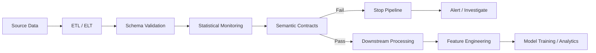

<div align="center">

# Semantic Contracts for Data Pipeline Reliability

### Detecting silent ETL failures that schema checks and drift monitoring can miss

[](https://www.python.org/)
[](https://github.com/idrees118/Research_Paper_Semantic-Contracts-mlops)
[](https://github.com/idrees118/Research_Paper_Semantic-Contracts-mlops)
[](https://github.com/idrees118/Research_Paper_Semantic-Contracts-mlops)
[](https://docs.pytest.org/)
[](#research)

**Python · ETL Validation · Data Quality · Mutation Testing · MLOps · Reproducible Research**

</div>

---

## At a glance

| | |
|---|---|
| **Problem** | ETL faults that keep every column looking normal but break the relationships between columns |
| **Approach** | 25 deterministic semantic contracts that check those relationships directly |
| **Controlled benchmark** | Detects **27 of 28** fault types (96.4%; 95% CI 82.3%–99.4%) |
| **Best statistical comparator** | Detects 14 of 28 (50.0%) |
| **Faults from real issue reports** | Alerts on **3 of 4** cases in each of two evaluation stages; comparators alert on at most 1 |
| **What it is not** | A replacement for schema checks, drift monitoring, Great Expectations, Deequ, dbt or Soda |

---

## The problem

A data pipeline can run successfully and still produce the wrong data.

The schema may be valid.  
The columns may still be numeric.  
Missing-value checks may pass.  
Distribution monitoring may show little change.

But the **meaning of the data can still be broken**.

Examples:

```text
Open / Close columns swapped
        ↓
Schema still valid

Timestamp shifted by 7 days
        ↓
Feature distributions unchanged

Five stores missing from an ETL batch
        ↓
Remaining rows still look normal

Weekly sales aggregated twice
        ↓
Pipeline finishes successfully
```

These faults are hard to catch because most validators look at one column at a time. If two columns with similar values are swapped, each column's distribution barely changes. If every timestamp moves by the same offset, the feature values do not change at all. A check that only inspects per-column statistics has nothing to react to.

This project explores how to detect these kinds of **silent relational failures before corrupted data reaches downstream analytics or machine-learning workflows**.

---

## What I built

I implemented a validation framework based on **semantic contracts**.

A semantic contract is a deterministic rule that checks whether an important relationship in an incoming dataset still holds relative to an accepted reference dataset.

Instead of checking only individual columns, the framework can validate relationships such as:

- column identity and cross-column consistency
- timestamp alignment and ordering
- expected entities and groups
- row-count relationships
- unit and scaling consistency
- categorical-frequency behaviour
- time-series structure
- duplication and missing-segment behaviour

The framework contains **25 domain-aware contracts** and evaluates them using controlled mutation testing.

Each contract returns a pass/fail flag and a confidence score between 0 and 1. A batch is flagged when at least one contract fires with confidence ≥ 0.10. The contracts need no model training, no labelled failure examples and no GPU.

### Contract families

The 25 contracts are built from a small set of reusable patterns. Each pattern is instantiated with dataset-specific columns and tolerances.

| Family | What it checks | Example fault it catches |
|---|---|---|
| **Ratio consistency** | Median ratio between test and reference values stays near 1 | Prices multiplied by 10 |
| **Temporal ordering** | Date range and autocorrelation profile are preserved | All timestamps shifted by 7 days |
| **Structural correlation** | Columns still correlate with their own reference column, not a different one | Open and Close swapped |
| **Entity completeness** | Every expected store or entity is still present | Five stores dropped |
| **Frequency invariance** | Category proportions stay stable | Two job categories swapped |

### Why existing tools are not enough on their own

Great Expectations, Deequ, dbt and Soda Core can already run cross-column checks through custom expectations or SQL. This project does not claim a new ability to execute such checks.

The contribution is:

1. a formal definition of the faults that per-column checks miss, with a proof of when a column swap stays invisible to a Kolmogorov–Smirnov test;
2. a taxonomy of 28 fault types grouped into four categories plus one aggregation case study;
3. a reproducible protocol for measuring whether a validation setup actually covers relational faults.

---

## Pipeline concept



The idea is not to replace schema or drift checks.

It is to add another validation layer for relationships that those checks may not explicitly represent.

---

## Mutation-testing approach

To evaluate the validation layer, I created controlled ETL-style faults with known ground truth.

The benchmark contains:

| | |
|---|---:|
| Semantic contracts | **25** |
| Controlled fault types | **28** |
| Random seeds | **4** |
| Seed-level executions | **112** |
| Primary datasets | **3** |
| Validation approaches compared | **4** |

The faults cover four main families plus one aggregation case study:

| Fault family | Count | Examples |
|---|---:|---|
| **Scaling** | 6 | unit conversion errors, incorrect calibration, systematic scaling |
| **Temporal** | 6 | timestamp shifts, lagged dates, reversed series, shuffled records |
| **Structural** | 9 | column swaps, missing entities, missing segments, repeated data |
| **Quality** | 6 | spikes, extreme outliers, frozen values, duplicate rows, sparse zeroing |
| **Aggregation** | 1 | repeated aggregation producing inflated values (single case study) |

### Why the sample size is 28, not 112

Each fault type runs under four random seeds. The four runs share the same dataset and the same contracts, and for deterministic faults (such as "multiply by 0.9") they produce identical output. They are repeated checks of one result, not four independent results.

All headline numbers and confidence intervals are therefore computed on the **28 fault types**. The seed runs are reported separately as a stability check: the semantic validator gave the same outcome on all four seeds for every fault type.

---

## Example failure

Consider a stock-data pipeline:

```text
Before ETL error

Open      Close
150.20    151.10
151.00    150.80


After accidental column swap

Open      Close
151.10    150.20
150.80    151.00
```

The schema is unchanged.

Both columns are still numeric.

Their distributions may also be very similar.

But their **relationship and meaning are wrong**.

A semantic contract can explicitly test that relationship rather than relying only on marginal statistics. In the benchmark, the KS, ensemble and GE-style comparators all miss this swap on the AAPL data; the structural-correlation contract catches it under every seed.

---

## Evaluation

The framework was evaluated across three different data domains:

| Dataset | Scale | What it tests |
|---|---:|---|
| **Walmart Retail Sales** | 6,435 store-week observations | entities, dates, sales, duplication, aggregation |
| **AAPL OHLCV** | 1,259 trading days | temporal and cross-column relationships |
| **Household Power Consumption** | 996,010 measurements | high-frequency sensor and temporal behaviour |

A separate **UCI Adult** experiment was also used as a proof-of-concept transfer to categorical data, and **UCI Wine Quality** was used as an additional clean control.

### Comparators

| Comparator | What it does |
|---|---|
| **KS Drift** | Per-column two-sample Kolmogorov–Smirnov test with Bonferroni correction |
| **Ensemble Statistical** | KS, Jensen–Shannon divergence, Population Stability Index, correlation-matrix difference and autocorrelation difference; flags if any one fires |
| **GE-style suite** | Eight hand-coded checks modelled on common Great Expectations rules (row count, mean, std, nulls, range, zeros, category completeness, sign). It does not call the Great Expectations library. |

---

## Results

Primary results are calculated at the **28 mutation-type level**.  
The four seeds are stability repetitions rather than independent observations.

| Validator | Faults detected | Detection rate | 95% Wilson CI |
|---|---:|---:|---:|
| **Semantic Contracts** | **27 / 28** | **96.4%** | 82.3%–99.4% |
| Ensemble Statistical | 14 / 28 | 50.0% | 32.6%–67.4% |
| KS Drift | 12 / 28 | 42.9% | 26.5%–60.9% |
| GE-style Expectations | 10 / 28 | 35.7% | 20.7%–54.2% |

### Is the difference statistically meaningful?

Paired exact McNemar tests on the 28 fault types:

| Comparison | Only semantic detects | Only comparator detects | p-value |
|---|---:|---:|---:|
| Semantic vs Ensemble | 13 | 0 | 0.000244 |
| Semantic vs KS | 15 | 0 | 0.000061 |
| Semantic vs GE-style | 17 | 0 | 0.000015 |

All three stay significant after Bonferroni correction for three tests. No fault type detected by a comparator is missed by the semantic validator.

### Other results

- **Semantic precision:** 96.3%. In 26 of the 27 detected fault types, the contract that fired belongs to the intended family.
- **Faults missed by every comparator:** 12 of 28, including both Walmart date shifts, the stock column swap, the stock timestamp lag and the power missing-segment fault.
- **The one miss:** `stock_noise_0.01`, Gaussian noise at 1% of a column's standard deviation. No validator detects it at the evaluated thresholds.
- **Ablation:** removing any one contract family lowers detection to 22–23 of 28, so no family is redundant.
- **Retrospective held-out check:** 19/19 on fault types used during contract refinement and 8/9 on the rest (Fisher's exact p = 0.321). Design choices were made before the split was formalised, so this is a robustness check, not a prospective test.
- **UCI Adult transfer:** all three injected faults detected, including a category-frequency swap missed by all three comparators.

> These results describe performance on the evaluated benchmark. They are not a claim that semantic contracts detect every possible production failure.

---

## Evaluation on publicly reported faults

The controlled faults and the contracts were written by the same team, which could favour faults the contracts were built to catch. To test the validator on failures described by other people, eight fault mechanisms were taken from public issue reports in **scikit-learn, dbt, pandas, Apache Spark, Airbyte and Polars**.

The original production data were not available, so each mechanism was reproduced deterministically on the closest study dataset. **No contract, threshold or comparator was changed** for this evaluation, and every outcome is reported, including the misses.

### Stage 1: initial evaluation

| Reported fault | How it was reproduced | Semantic | Ensemble | KS | GE-style |
|---|---|:---:|:---:|:---:|:---:|
| Feature-order mismatch (scikit-learn) | Swap the positions, not the labels, of Open and Close | ✗ | ✗ | ✗ | ✗ |
| Duplicate rows from null keys (dbt) | Duplicate a fixed 3% subset with a null key | ✓ | ✗ | ✗ | ✗ |
| Duplicate aggregation output (pandas) | Split 3% of Store–Date groups into two rows, preserving each sum | ✓ | ✓ | ✗ | ✗ |
| Timezone-conversion error (Spark) | Shift all power timestamps back by 7 hours | ✓ | ✗ | ✗ | ✗ |
| **Alerts** | | **3/4** | 1/4 | 0/4 | 0/4 |

### Stage 2: pre-specified extension

Before Stage 2 was run, its four cases, transformations, reporting rule and output paths were fixed in the script. SHA-256 hashes of that script, the validators, the comparators and the input data were recorded in `protocol.json`.

| Reported fault | How it was reproduced | Semantic | Ensemble | KS | GE-style |
|---|---|:---:|:---:|:---:|:---:|
| Latest-record replay (Airbyte) | Append one copy of the latest record (+0.016% rows) | ✗ | ✗ | ✗ | ✗ |
| One-to-many join expansion (Polars) | Duplicate rows for one store key (+2.22% rows) | ✓ | ✗ | ✗ | ✗ |
| Cursor-boundary omission (Airbyte) | Remove the record at the median timestamp | ✓\* | ✗ | ✗ | ✗ |
| Missing output partition (Spark) | Drop 1 of 100 time-ordered partitions (1.00% rows) | ✓ | ✗ | ✗ | ✗ |
| **Alerts** | | **3/4** | 0/4 | 0/4 | 0/4 |

\* The table was flagged, but by the spike contract, because removing one row shifted the positional alignment of later rows. The alert is correct; the diagnosis is not.

### What the misses show

- **Feature-order mismatch:** the contracts look up columns by name, so reordering columns without renaming them is invisible. Catching it would need a contract that checks column position at the model interface.
- **Single-record replay:** one extra row out of 6,435 is far below the 2% duplicate-row threshold, which was kept fixed.

These cases were chosen and reproduced by the authors, so they reduce, but do not remove, the dependence on self-designed faults. They are reported descriptively, without a pooled rate, and are not added to the 27/28 headline.

### Run it

```bash
python scripts/external_incident_validation.py   # Stage 1
python scripts/external_incident_holdout.py      # Stage 2
```

Results are written to:

```text
experiments/external_incident_validation/        # Stage 1
experiments/external_incident_holdout_final/     # Stage 2
```

Each folder contains the case-level results (`*_results.csv`), a `summary.json` with alert counts, and the `protocol.json` recording the fixed protocol and artifact hashes.

---

## Limitations

Stated plainly, so the results are read at the right strength:

- **Clean controls are few.** The semantic validator raised no alerts on five clean datasets, but with only five the 95% upper bound on the false-alarm rate is 43.4%. This is early evidence, not a measured false-positive rate.
- **Contracts are written by hand.** Each new dataset needs someone who understands the domain to choose the invariants and tolerances. Authoring effort was not measured.
- **Faults are synthetic or reproduced.** No original production incident data were used.
- **Comparators are fixed configurations.** The results describe these implementations, not the full capability of Great Expectations, Evidently, TFDV or other extensible tools.
- **Tabular data only.** Text, images and other modalities are not evaluated.

---

## Why this is relevant to Data Engineering

For me, the main engineering question behind this project was:

> **How do we stop technically valid but semantically corrupted data from moving further through a pipeline?**

That connects directly to several Data Engineering concerns:

**Data quality**

Validate not only whether values are present, but whether relationships between them remain correct.

**Pipeline testing**

Inject controlled failures and measure whether the validation layer actually catches them.

**ETL reliability**

Detect issues such as duplication, missing entities, incorrect transformations and timestamp errors before downstream use.

**Data contracts**

Express expectations about what data should mean, not only how it should be typed.

**MLOps**

Use validation as a gate between an incoming ETL batch and downstream feature engineering or model training.

**Reproducibility**

Keep mutations, thresholds, experiment configuration, statistical analysis and outputs version-controlled.

---

## Project architecture

```text
Research_Paper_Semantic-Contracts-mlops/
│
├── main.py
│
├── configs/
│   └── experiment.yaml
│
├── src/
│   ├── mutations/
│   │   ├── operators.py               # 28 fault operators
│   │   └── registry.py
│   │
│   ├── validators/
│   │   ├── contracts.py               # 25 semantic contracts
│   │   └── semantic_validator.py
│   │
│   ├── baselines/
│   │   ├── ensemble_baseline.py
│   │   ├── ks_drift_baseline.py
│   │   └── ge_baseline.py
│   │
│   └── evaluation/
│       ├── runner.py
│       └── metrics.py
│
├── scripts/
│   ├── prepare_datasets.py
│   ├── run_experiment.py
│   ├── held_out_evaluation.py
│   ├── ablation_analysis.py
│   ├── adult_validation.py
│   ├── wine_fpr.py
│   ├── external_incident_validation.py   # public-incident evaluation, Stage 1
│   └── external_incident_holdout.py      # public-incident evaluation, Stage 2
│
├── tests/
│   └── test_pipeline.py
│
├── data/
├── experiments/
│   ├── results/
│   ├── external_incident_validation/
│   └── external_incident_holdout_final/
├── requirements.txt
├── setup.py
└── pytest.ini
```

The code is separated into **fault generation, validation, baseline methods and evaluation**, rather than placing the full experiment inside one notebook.

---

## Testing

The repository includes **37 tests** covering:

- semantic contracts
- mutation operators
- statistical metrics
- baseline validators
- clean-data behaviour
- mutation registry integrity
- semantic-validator integration
- mini end-to-end experiment execution

Run them with:

```bash
python main.py --test
```

or:

```bash
pytest tests/ -v
```

---

## Run the project

Clone the repository:

```bash
git clone https://github.com/idrees118/Research_Paper_Semantic-Contracts-mlops.git
cd Research_Paper_Semantic-Contracts-mlops
```

Create an environment:

```bash
python -m venv .venv
source .venv/bin/activate
```

Install dependencies:

```bash
pip install -r requirements.txt
```

Prepare the datasets:

```bash
python main.py --prepare
```

Run the controlled experiment:

```bash
python main.py --experiment
```

Run the retrospective held-out analysis:

```bash
python main.py --held-out
```

Or run the main workflow:

```bash
python main.py --all
```

---

## Reproduce additional analyses

```bash
# Detector-family ablation
python scripts/ablation_analysis.py

# UCI Adult transfer experiment
python scripts/adult_validation.py

# Additional clean-control analysis
python scripts/wine_fpr.py

# Public-incident evaluation (Stage 1 and Stage 2)
python scripts/external_incident_validation.py
python scripts/external_incident_holdout.py
```

Experiment settings such as seeds and validation thresholds are centralised in:

```text
configs/experiment.yaml
```

---

## Tech stack

| Area | Technologies |
|---|---|
| Language | Python |
| Data processing | pandas, NumPy |
| Statistical analysis | SciPy, statsmodels |
| Configuration | YAML |
| Testing | pytest |
| Engineering concepts | ETL validation, data contracts, mutation testing |
| ML infrastructure | MLOps, pre-training data validation |
| Reproducibility | versioned configs, experiment outputs, deterministic mutations, SHA-256 protocol hashes |

---

## Data sources

**Walmart Retail Sales**  
https://www.kaggle.com/c/walmart-recruiting-store-sales-forecasting

**Apple AAPL Historical Data — Yahoo Finance**  
https://finance.yahoo.com/quote/AAPL/history/

**UCI Household Electric Power Consumption**  
https://doi.org/10.24432/C58K54

**UCI Wine Quality**  
https://doi.org/10.24432/C56S3T

**UCI Adult**  
https://doi.org/10.24432/C5XW20

**Public issue reports used in the incident evaluation**  
[scikit-learn #7242](https://github.com/scikit-learn/scikit-learn/issues/7242) ·
[dbt-core #7873](https://github.com/dbt-labs/dbt-core/issues/7873) ·
[pandas #43067](https://github.com/pandas-dev/pandas/issues/43067) ·
[SPARK-23715](https://issues.apache.org/jira/browse/SPARK-23715) ·
[Airbyte #14066](https://github.com/airbytehq/airbyte/issues/14066) ·
[Polars #13550](https://github.com/pola-rs/polars/issues/13550) ·
[Airbyte #14732](https://github.com/airbytehq/airbyte/issues/14732) ·
[SPARK-23895](https://issues.apache.org/jira/browse/SPARK-23895)

---

## Research

This repository supports the manuscript:

**Semantic Contracts for Detecting Relational Faults in Machine Learning Pipelines: A Mutation-Based Empirical Evaluation**

**Current status:** manuscript under review.

Authors:

**Muhammad Idrees · Feras Al-Obeidat · Adnan Amin · Salma Noor · Fernando Moreira**

The study positions semantic contracts as a **complementary validation layer**, not as a replacement for tools such as Great Expectations, Deequ, dbt, Soda, or statistical monitoring systems.

---

## Key takeaway

A reliable data pipeline should not only ask:

> **“Does this batch have the correct schema?”**

It should also be able to ask:

> **“Do the relationships inside this data still make sense?”**

That is the problem this project explores.

---

<div align="center">

### Data Engineering · Data Quality · ETL Reliability · MLOps · Mutation Testing

[View Repository](https://github.com/idrees118/Research_Paper_Semantic-Contracts-mlops) ·
[Open an Issue](https://github.com/idrees118/Research_Paper_Semantic-Contracts-mlops/issues)

</div>
